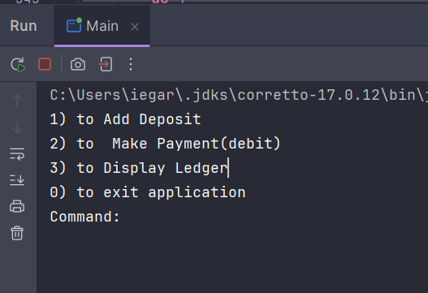
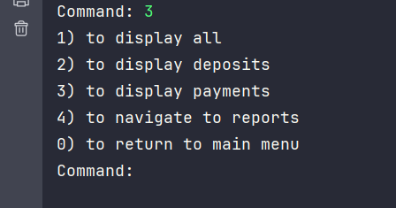
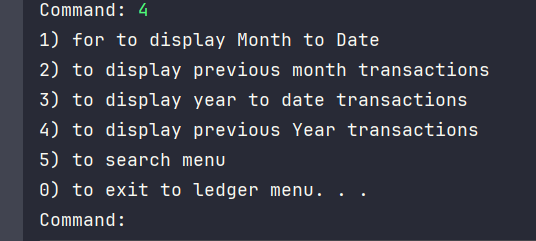
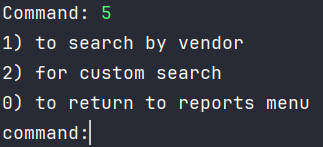
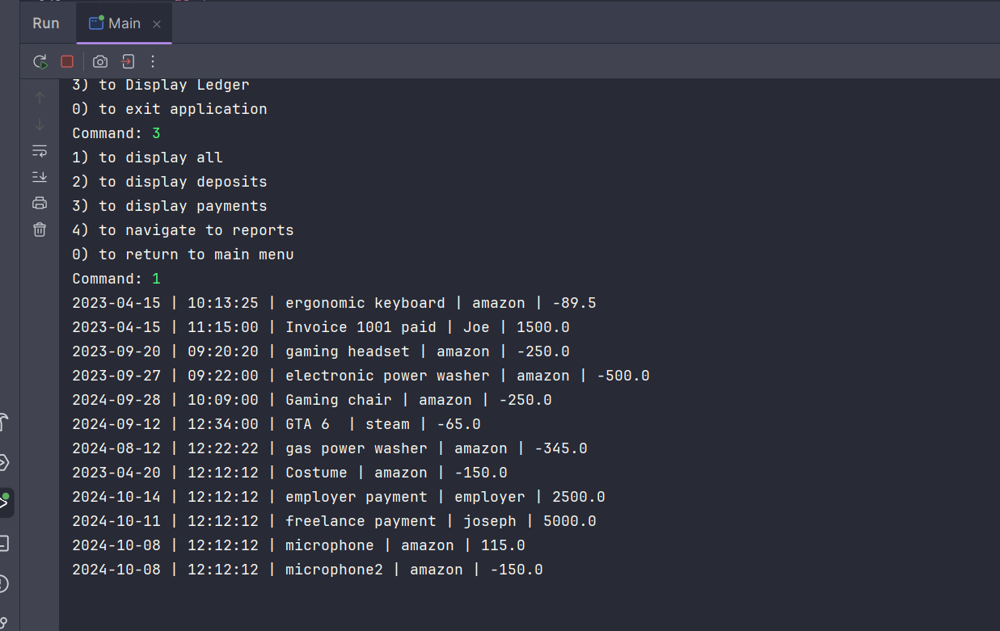
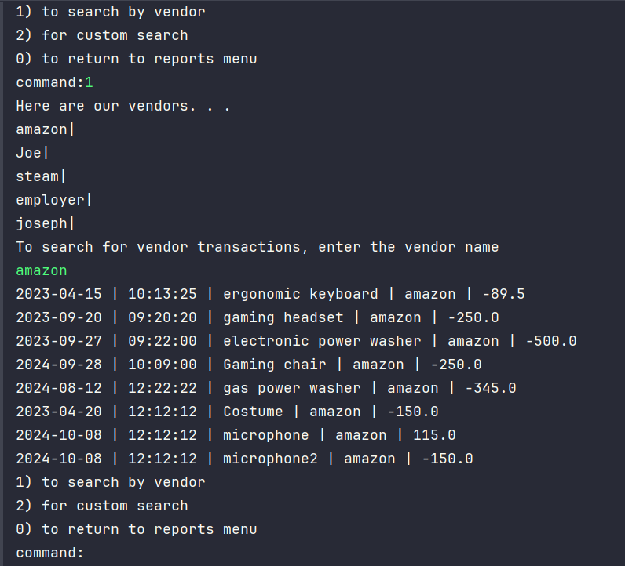
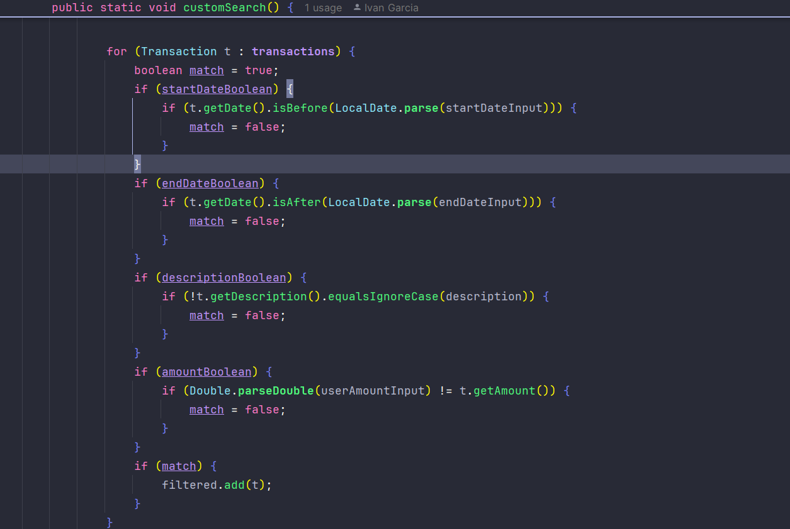

# Accounting Ledger Application

## Description
This is an Accounting Ledger application that helps users track and manage their 
transactions. This application allows users to make accurate deposits and payments as well as filtering through 
all fo the transactions and then searching through them by matching criteria. 

# Main menu screen 

The main menu screen allows you to add deposits and make payments

# Ledger Menu Screen

# Reports Menu

# Custom Search Menu

# Displaying all Transactions

# Search by Vendor

In this case, I first displayed all of the vendors that are in transactions and then prompted the user to search by vendor name, then if the vendor matches the users input it will display all the vendors for that search.

# Interesting Piece of code

This piece of code loops through all the transactions and if they are a match, they will be pushed to the Arraylist and then displays filtered transactions that match.

